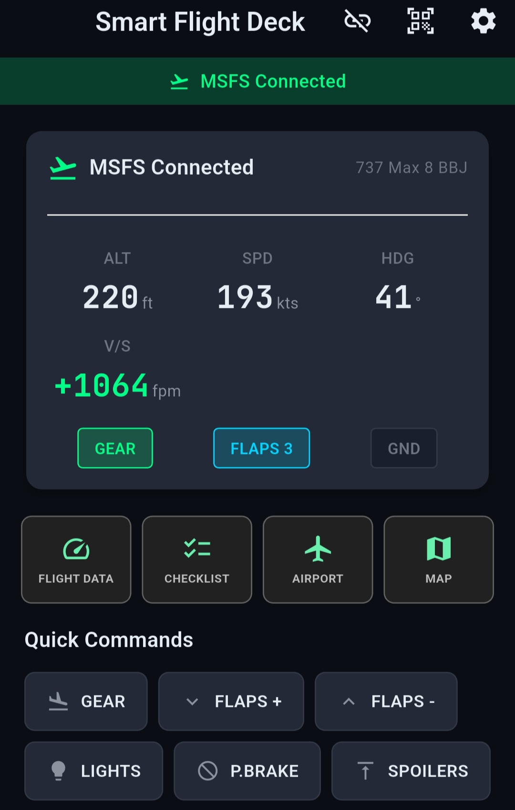
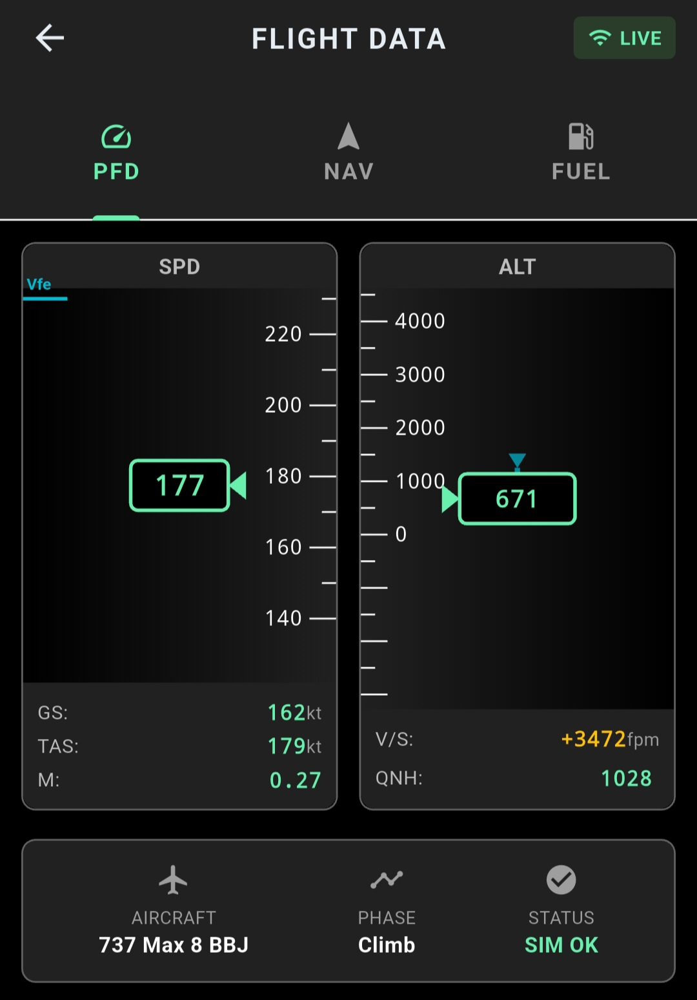
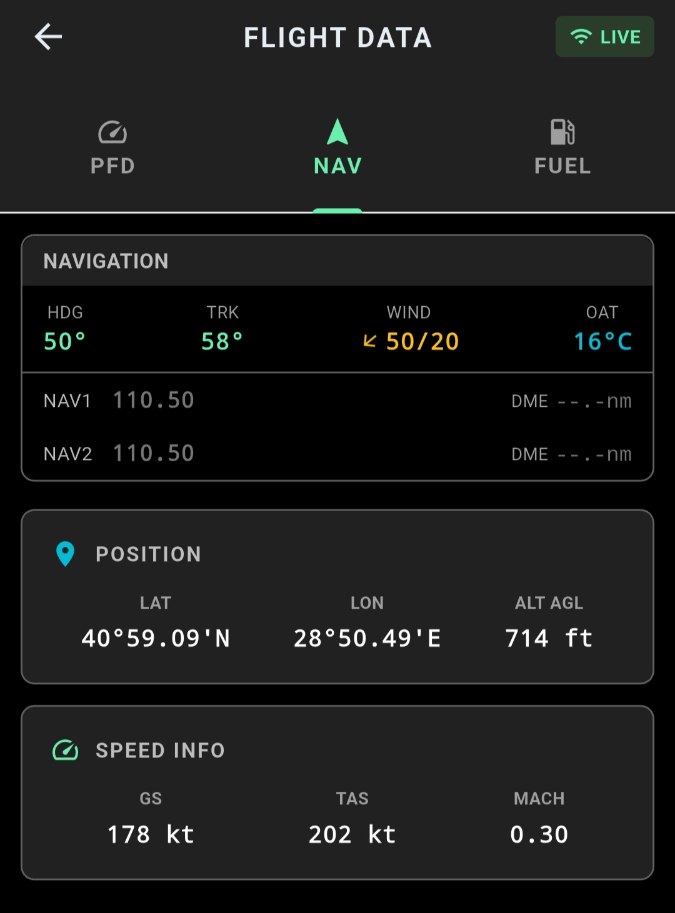

# Smart Flight Deck

Voice command and checklist assistant for Microsoft Flight Simulator, with a Flutter mobile companion app.

A Python service on the PC talks to the simulator through SimConnect, understands spoken commands, tracks the current flight phase and checks every command against safety rules before sending it. The phone connects to that service over the local network and shows live flight data.

<p align="center">
  
  &nbsp;
  
  &nbsp;
  
</p>

## Features

- **Voice commands.** Push-to-talk on the phone or PC → voice activity detection → local speech recognition (faster-whisper) → pattern-based command parser → simulator. Different phrasings map to the same intent ("gear down", "lower the gear" → `gear_down`).
- **Flight context engine.** Detects 11 flight phases from live simulator data (preflight, engine start, taxi, takeoff, climb, cruise, descent, approach, landing, go-around, shutdown), with a short confirmation delay to avoid flickering between phases.
- **Safety rule engine.** Evaluates each command against the current phase and the aircraft's speed limits (Vmo, Vle, Vfe…) and returns `ALLOW`, `REMIND`, `WARN`, `CONFIRM` or `BLOCK`, with the reason and an override option.
- **Checklists.** Challenge-response checklists defined per aircraft in JSON (PMDG 737, Fenix A320, FlyByWire A32NX), with items verified against simulator data.
- **Mobile companion.** Flutter app that pairs with the PC by QR code and connects over WebSocket on the same Wi-Fi network: live PFD / NAV / FUEL data and quick commands.
- **Runs locally.** Speech recognition and text-to-speech (Piper, public-domain voices) run on the PC; no cloud API is needed.

## Architecture

```
 Phone (Flutter)  ── WebSocket / REST (LAN) ──►  PC Bridge (Python, FastAPI)  ── SimConnect / MobiFlight WASM ──►  MSFS
                                                  ├── audio   VAD, Whisper STT, Piper TTS
                                                  ├── logic   command parser, context engine, safety rules, checklists
                                                  └── sim     SimConnect connection, aircraft detection
```

| Folder | Contents |
|---|---|
| `bridge/` | PC service (Python, FastAPI) and unit tests |
| `mobile/` | Companion app (Flutter) |
| `docs/` | Design and API documentation |
| `installer/` | Packaging script and firewall rule |

## Status

Personal project, in development.

- **Working:** voice commands, live flight data, flight phase detection, safety rules, QR pairing, local TTS.
- **In progress:** checklist screens are being redesigned; the Map and Airport screens are placeholders.
- Microsoft Flight Simulator (2020 / 2024) only.

## Getting started

Requirements: Windows 10/11, Microsoft Flight Simulator 2020/2024, Python 3.10+, Flutter SDK (for the mobile app).

**PC bridge**

```bash
cd bridge
python -m venv venv
venv\Scripts\activate
pip install -r requirements.txt
python scripts/download_tts_voices.py
python main.py
```

The Whisper model is downloaded automatically on first run. Open `http://localhost:8080` to see the pairing QR code.

**Mobile app**

```bash
cd mobile
flutter run
```

Scan the QR code from the app. The phone and the PC must be on the same network; if the connection is blocked, run `installer/firewall.ps1` as administrator.

**Tests**

```bash
cd bridge
python -m pytest tests
```

## Documentation

| Document | Topic |
|---|---|
| [SETUP.md](docs/SETUP.md) | Installation, configuration, troubleshooting |
| [API.md](docs/API.md) | REST and WebSocket API |
| [CONTEXT_ENGINE.md](docs/CONTEXT_ENGINE.md) | Flight phase detection and safety rules |
| [CHECKLIST_SYSTEM.md](docs/CHECKLIST_SYSTEM.md) | Checklist format and verification |
| [VOICE_COMMANDS.md](docs/VOICE_COMMANDS.md) | Supported voice commands |
| [SIMCONNECT_ROADMAP.md](docs/SIMCONNECT_ROADMAP.md) | Simulator variable coverage |
| [MOBILE_DESIGN.md](docs/MOBILE_DESIGN.md) | Mobile app design |
| [TEST.md](docs/TEST.md) | Test plan and results |

## License

All rights reserved. The source is published for viewing; please contact me before reusing it.
